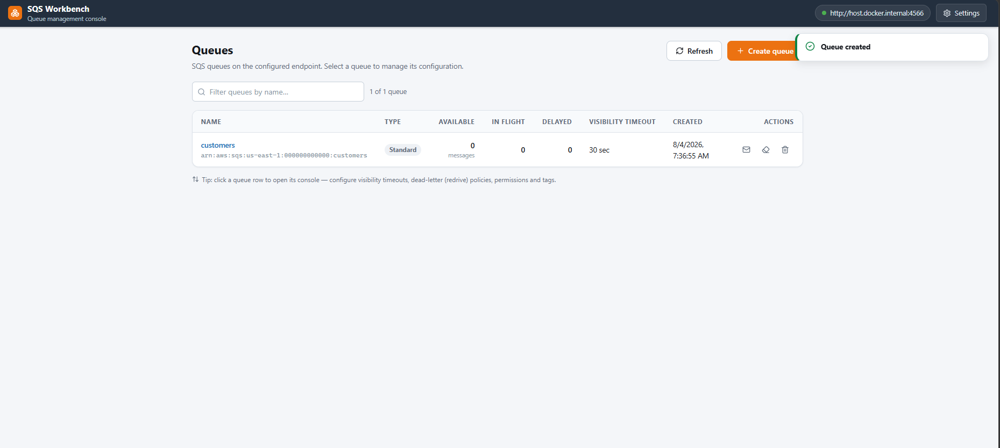
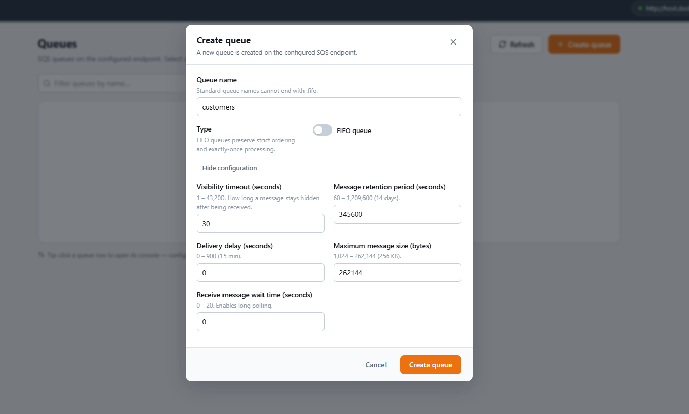
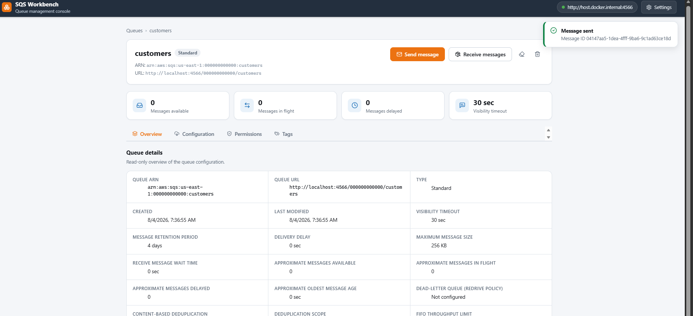

# SQS Workbench

A **browser-only** web console for managing [Amazon SQS](https://aws.amazon.com/sqs/) queues — on local emulators
([floci](https://hub.docker.com/r/floci/floci), LocalStack, ElasticMQ) or real AWS. There is no backend: the app talks
to the SQS HTTP API directly from your browser (SigV4 signing happens in-browser via the Web Crypto API), so it can be
hosted as plain static files anywhere.

  

## Screenshots

| <a href="screenshots/screenshot_queues.png"></a> | <a href="screenshots/screenshot_createqueue.png"></a> | <a href="screenshots/screenshot_queuedetails.png"></a> |
| --- | --- | --- |

## Features

- **Homepage** — lists every queue on the configured endpoint with live message counts, type (Standard/FIFO),
  visibility timeout and creation time. Row actions: **send message**, **purge**, **delete**; a search box filters by name.
- **Create queue dialog** — Standard or **FIFO queue** (with name validation), plus configurable visibility timeout,
  retention period, delivery delay, max message size, receive wait time and content-based deduplication.
- **Queue console (AWS-style)** — click any queue to open its detail page with tabs:
  - **Overview** — ARN, URL, timestamps, message metrics, redrive policy summary and more.
  - **Configuration** — edit visibility timeout, retention, delay, max size, wait time, content-based dedup, and
    configure a **dead-letter queue (redrive policy)** by picking an existing queue + max receive count, or remove it.
  - **Permissions** — view/edit the resource-based access policy (JSON).
  - **Tags** — add, edit and remove tags.
  - **Send / Receive messages** — send with message attributes, delay, and FIFO group/deduplication IDs; receive with
    polling controls, inspect system/message attributes, and delete (acknowledge) messages.
  - **Start redrive** — move every message out of a dead-letter queue back to its **source queue** (detected automatically)
    or to a **custom destination**, with a velocity control (**system optimized** or a custom cap of up to 500 messages
    per second) and a live progress view that can be stopped mid-run. Uses the managed SQS message move task API when the
    endpoint supports it, and otherwise runs the receive/send/delete loop **in your browser**.
- **Settings** — the gear icon opens connection settings (AWS endpoint URL, region, access key, secret access key)
  with a **test connection** button. Settings are stored in the browser (localStorage) and take effect immediately.

## Hosting: the app is 100% static

```bash
cd frontend
npm install
npm run build      # outputs plain static files to frontend/dist
```

`dist/` contains everything — host it on GitHub Pages, Cloudflare Pages, Netlify, S3, or any static file server. The app
uses hash-based routing, so deep links and refreshes work on any static host without rewrite rules.

## Run locally against your emulator

```bash
# 1. Start an SQS emulator (optional) — e.g. floci
docker run -p 4566:4566 floci/floci:latest

# 2. Run the workbench (dev server on http://localhost:3000)
cd frontend && npm install && npm run dev
```

Open <http://localhost:3000>. In the top right corner, open **Settings** and set the endpoint of your emulator
(e.g. `http://localhost:4566`, credentials `test` / `test`) and hit **Test connection**.

## CORS — the one thing that matters when hosting

Browsers only let a page read responses from an endpoint that sends CORS headers for the page's origin. So the SQS
endpoint you point the app at must allow requests from wherever the app is hosted.

| Endpoint | CORS status |
| --- | --- |
| **LocalStack** | ✅ Sends CORS headers out of the box |
| **floci** | ⚠️ Only if started with your app origin allowed (see your emulator's docs) |
| **ElasticMQ** | ❌ No CORS support — use the bundled CORS bridge |
| **Real AWS** | ✅ Yes (SQS supports CORS) |

**Bundled CORS bridge** — for emulators that don't send CORS headers (stock floci, ElasticMQ), run the tiny proxy and
point the workbench at it instead:

```bash
TARGET=http://localhost:4566 PORT=4567 node scripts/cors-proxy.mjs
# then set the workbench endpoint to http://localhost:4567
```

The same bridge is available as the `cors-proxy` service in `docker-compose.yml` (see below).

**Mixed content note** — if the workbench is hosted over HTTPS, browsers still allow it to fetch `http://localhost`
and `http://127.0.0.1` (loopback is exempt from mixed-content blocking), but **not** `http://192.168.x.x` LAN addresses.
Use `localhost` for your emulator endpoint.

## docker-compose (emulator + optional CORS bridge)

```bash
docker compose up -d
# sqs on http://localhost:4566, cors bridge on http://localhost:4567
```

The `cors-proxy` service is optional — skip it if your emulator already sends CORS headers.

## Security notes

- Connection settings (including the secret key, if any) are stored in **your browser's localStorage** on the machine
  you use the app from.
- Local emulators accept any credentials (e.g. `test` / `test`); for AWS use a real key pair with SQS permissions.
- Do **not** enter real AWS keys on a shared/public instance of the hosted app — they would be stored in that browser
  and are visible to anyone who uses that machine.

## Project layout

```
frontend/                 React + TypeScript + Vite app (the entire product)
frontend/dist/            Static build output — host this anywhere
scripts/cors-proxy.mjs    Optional CORS bridge for emulators without CORS support
docker-compose.yml        floci emulator + optional CORS bridge for local testing
screenshots/              README screenshots
```
